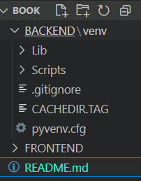
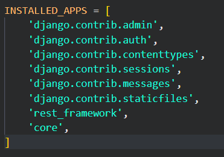

- Setting up our python backend
- Creating our Reactjs Frontend
- Page navigation with React Js Frontend
- Creating a Navrbar with MUI
- 

-------------
## Backend project and env setupBasic CRUD operation
- creating a virtual environment
- Installing packages
- creating our django project and app
- changing our settings
- including our urls
- Migrating our database


- Create two folder named as frontend and backend
- PS C:\Users\learn\OneDrive\Desktop\Book> cd .\BACKEND\
PS C:\Users\learn\OneDrive\Desktop\Book\BACKEND> py -m pip install virtualenv
Defaulting to user installation because normal site-packages is not writeable
Requirement already satisfied: virtualenv in c:\users\learn\appdata\roaming\python\python313\site-packages (20.29.1)
Requirement already satisfied: distlib<1,>=0.3.7 in c:\users\learn\appdata\roaming\python\python313\site-packages (from virtualenv) (0.3.9)
Requirement already satisfied: filelock<4,>=3.12.2 in c:\users\learn\appdata\roaming\python\python313\site-packages (from virtualenv) (3.17.0)
Requirement already satisfied: platformdirs<5,>=3.9.1 in c:\users\learn\appdata\roaming\python\python313\site-packages (from virtualenv) (4.3.6)

[notice] A new release of pip is available: 25.0 -> 25.1.1
[notice] To update, run: python.exe -m pip install --upgrade pip
- PS C:\Users\learn\OneDrive\Desktop\Book\BACKEND> py -m virtualenv venv       
- 
- C:\Users\learn\OneDrive\Desktop\Book\BACKEND>cd venv
- C:\Users\learn\OneDrive\Desktop\Book\BACKEND\venv>cd Scripts
- C:\Users\learn\OneDrive\Desktop\Book\BACKEND\venv\Scripts>activate
### Installing packages
- (venv) C:\Users\learn\OneDrive\Desktop\Book\BACKEND>py -m pip install django
- Install nodejs (https://nodejs.org/en) download the latest version
- (venv) C:\Users\learn\OneDrive\Desktop\Book\BACKEND>npm install -g np
m
- (venv) C:\Users\learn\OneDrive\Desktop\Book\BACKEND>pip install djangorestframework
- (venv) C:\Users\learn\OneDrive\Desktop\Book\BACKEND>django-admin star
tproject infrahub
- (venv) C:\Users\learn\OneDrive\Desktop\Book\BACKEND>django-admin startapp core
- Install the app in settings.py 
- In infrahub urls.py configure the app url
- 
- Inside core app create urls.py file to keep project urls
- (venv) C:\Users\learn\OneDrive\Desktop\Book\BACKEND>python manage.py makemigrations
No changes detected

- (venv)C:\Users\learn\OneDrive\Desktop\Book\BACKEND>python manage.py migrate       
Operations to perform:
  Apply all migrations: admin, auth, contenttypes, sessions
Running migrations:
  Applying contenttypes.0001_initial... OK
  Applying auth.0001_initial... OK
  Applying admin.0001_initial... OK
  Applying admin.0002_logentry_remove_auto_add... OK
  Applying admin.0003_logentry_add_action_flag_choices... OK
  Applying contenttypes.0002_remove_content_type_name... OK
  Applying auth.0002_alter_permission_name_max_length... OK
  Applying auth.0003_alter_user_email_max_length... OK
  Applying auth.0004_alter_user_username_opts... OK
  Applying auth.0005_alter_user_last_login_null... OK        
  Applying auth.0006_require_contenttypes_0002... OK
  Applying auth.0007_alter_validators_add_error_messages... OK
  Applying auth.0008_alter_user_username_max_length... OK    
  Applying auth.0009_alter_user_last_name_max_length... OK   
  Applying auth.0010_alter_group_name_max_length... OK
  Applying auth.0011_update_proxy_permissions... OK
  Applying auth.0012_alter_user_first_name_max_length... OK  
  Applying sessions.0001_initial... OK

- (venv) C:\Users\learn\OneDrive\Desktop\Book\BACKEND>py manage
.py runserver
Watching for file changes with StatReloader
Performing system checks...

System check identified no issues (0 silenced).
June 03, 2025 - 15:48:30
Django version 5.2.1, using settings 'infrahub.settings'     
Starting development server at http://127.0.0.1:8000/        
Quit the server with CTRL-BREAK


## FRONTEND
- Creating our Reactjs Frontend app
- Inspecting the folder structure
- Adding Components folder
- Installing Django Cors Headers in our backend
- Changing our settings.py file in our backend

## steps
- C:\Users\learn\OneDrive\Desktop\Book>npx create-react-app frontend
- C:\Users\learn\OneDrive\Desktop\Book>cd frontend

C:\Users\learn\OneDrive\Desktop\Book\frontend>npm start
- create components folder insid frontend/src


## connecting frontend with backend 
- bcz frontend  is running in http://localhost:3000 and backend is running in http://127.0.0.1:8000/       
- So before that  install(https://pypi.org/project/django-cors-headers/)
- (venv) C:\Users\learn\OneDrive\Desktop\Book\BACKEND>pip install django-cors-headers
- then add it in settings.py apps ( "corsheaders",)
- will also need to add a middleware class to listen in on responses:
```
MIDDLEWARE = [
    ...,
    "corsheaders.middleware.CorsMiddleware",
    "django.middleware.common.CommonMiddleware",
    ...,
]
```
- Configuration
Configure the middleware’s behaviour in your Django settings. You must set at least one of three following settings:
```
CORS_ALLOWED_ORIGINS
CORS_ALLOWED_ORIGIN_REGEXES
CORS_ALLOW_ALL_ORIGINS
```
```
Example:

CORS_ALLOWED_ORIGINS = [
    "https://example.com",
    "https://sub.example.com",
    "http://localhost:8080",
    "http://127.0.0.1:9000",
]
```
- set this in settings.py file
> CORS_ALLOWED_ORIGINS = [
    'http://localhost:3000/',  
]


## Page Navigation with React Router
- Installing React Router DOM(https://www.npmjs.com/package/react-router-dom - webiste link)
- Adding BrowserRouter in our index.js file
- Creating JavaScript pages
- Adding Routes in our app.js file

### steps
- npm i react-router-dom

##  Creating a Navrbar with MUI
- Installing packages for MUI
- Picking our preferred Navigation Menu
- Customizing it to display our menu items
- Adding the Navbar to our App.js file
- Fitting our content in the remaining space
- Making our Navigation menu response
### steps
- MUI(website - https://mui.com/material-ui/)
- C:\Users\learn\OneDrive\Desktop\Book\frontend>npm install @mui/material @emotion/react @emotion/styled
- MUI icons - https://mui.com/material-ui/material-icons/
- C:\Users\learn\OneDrive\Desktop\Book\frontend>npm install @mui/icons-material 
- 